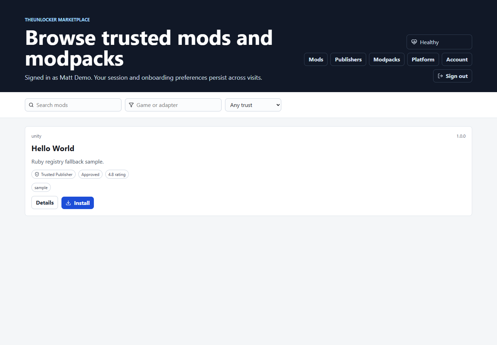
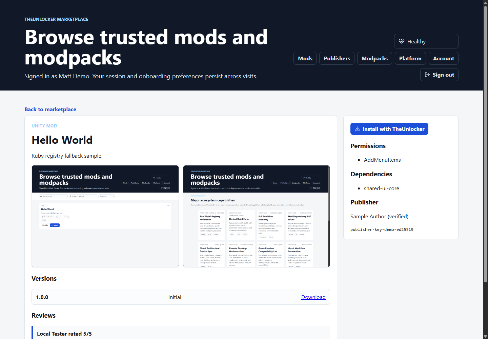
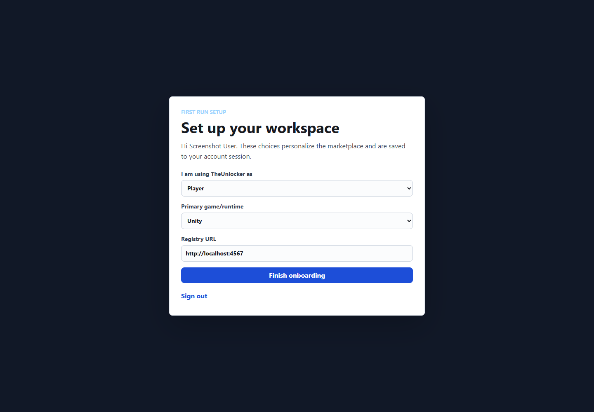
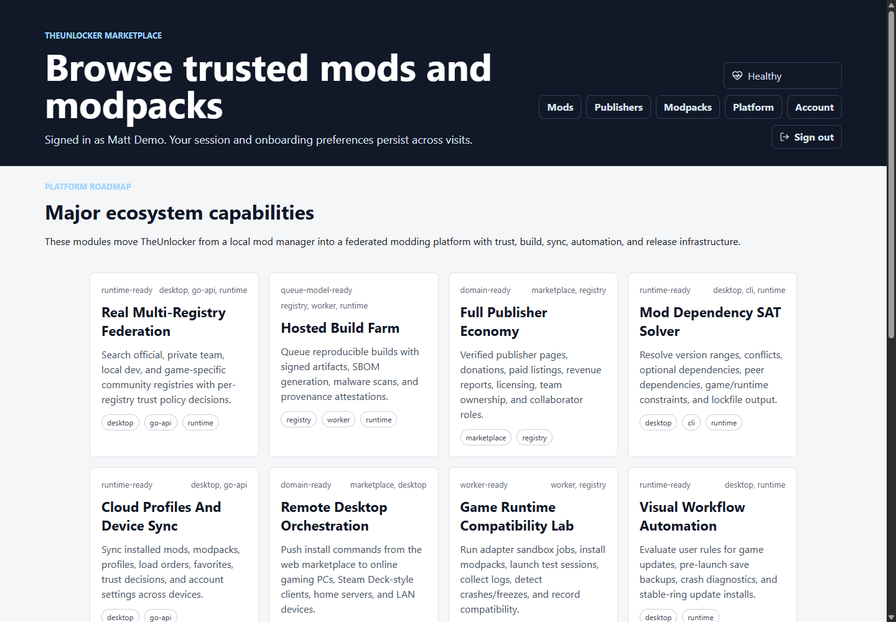

# The Unlocker

[](https://github.com/theunlocker/theunlocker/actions/workflows/dotnet-ci.yml)
[](https://github.com/theunlocker/theunlocker/actions/workflows/release.yml)
[](ROADMAP.md)
[](LICENSE)
[](https://dotnet.microsoft.com/)
[](frontend/marketplace)
[](frontend/marketplace)
[](backend/go-api)
[](backend/ruby-registry)
[](backend/rust-worker)
[](deploy/docker-compose.yml)
[](backend/go-api)
[](TheUnlocker.Modding.Abstractions)
[](SECURITY.md)

The Unlocker is a safe, local-first modding platform for desktop applications and game-adjacent tools.

It combines a WPF desktop manager, a Vite + React marketplace frontend, a Go API gateway, Ruby and .NET registry services, Rust and .NET background workers, a mod SDK, packaging tools, policy controls, sample mods, and root-level GitHub documentation.

The goal is simple:

Give players, mod authors, teams, and publishers a clean way to discover, validate, install, update, disable, inspect, and recover mods without turning the application into a risky pile of manual file copies.

The project is built around explicit extension points.

Mods declare what they are, what they depend on, what permissions they request, what app or game versions they support, and what safe services they want to use.

The platform then handles the hard parts:

- Discovery
- Validation
- Dependency resolution
- SAT-style version solving
- Version checks
- Package integrity
- Signing
- Trust policy
- Policy-as-code
- Multi-registry federation
- Hosted build farm workflows
- Cloud profile sync
- Remote orchestration
- Compatibility lab results
- Runtime observability
- Sandboxed service access
- Profiles
- Recovery
- Marketplace browsing
- Versioned API access
- Registry workflows
- Diagnostics
- Developer tooling

The Unlocker does not provide tools for licensing bypasses, anti-cheat bypasses, ownership bypasses, authentication bypasses, integrity-check evasion, or arbitrary patching of protected third-party applications.

It is a modding platform, not a bypass toolkit.

---

## Project Snapshot

| Symbol | Area | What It Means |
| --- | --- | --- |
| [D] | Desktop | WPF manager, local profiles, recovery, diagnostics, and safe mod controls. |
| [M] | Marketplace | Vite + React interface for mods, modpacks, trust, policy, publishers, and docs. |
| [A] | API | Go public gateway with OpenAPI, auth gates, security headers, and `/api/v1` routes. |
| [R] | Registry | Ruby and .NET registry services for accounts, package metadata, moderation, and storage. |
| [W] | Workers | Rust and .NET workers for scans, compatibility jobs, build farm tasks, and webhooks. |
| [S] | Security | Signing, permissions, policy simulation, trust scoring, quarantine, and recovery. |
| [K] | SDK | Stable abstractions, sample mods, templates, analyzers, and author tooling. |
| [G] | GitHub | Root docs, CI, issue templates, PR template, screenshots, and contributor guidance. |

| Preview | Surface |
| --- | --- |
|  | [M] Marketplace browsing with trusted mod cards and filters. |
|  | [M] Mod detail view with versions, trust state, permissions, and install links. |
|  | [D] First-run onboarding for game, registry, role, and local defaults. |
|  | [G] Platform capability dashboard for registry, workers, policy, and release systems. |

---

## Table Of Contents

- [Project Snapshot](#project-snapshot)
- [Visual Section Guide](#visual-section-guide)
- [Purpose](#purpose)
- [Why This Exists](#why-this-exists)
- [What It Does](#what-it-does)
- [Current Status](#current-status)
- [Major Platform Upgrades](#major-platform-upgrades)
- [UI Screenshot Previews](#ui-screenshot-previews)
- [Architecture At A Glance](#architecture-at-a-glance)
- [Repository Layout](#repository-layout)
- [Technology Stack](#technology-stack)
- [Quick Start](#quick-start)
- [Run Everything With Docker Compose](#run-everything-with-docker-compose)
- [Run The Containerized Release](#run-the-containerized-release)
- [Run The Desktop App](#run-the-desktop-app)
- [Run The Marketplace Frontend](#run-the-marketplace-frontend)
- [Run The Ruby Registry Facade](#run-the-ruby-registry-facade)
- [Run The Go API Gateway](#run-the-go-api-gateway)
- [Run The Rust Worker](#run-the-rust-worker)
- [Run The .NET Registry API](#run-the-net-registry-api)
- [Run Tests](#run-tests)
- [Create And Package A Sample Mod](#create-and-package-a-sample-mod)
- [Mod Author Workflow](#mod-author-workflow)
- [Registry And Marketplace Workflow](#registry-and-marketplace-workflow)
- [Persistent Accounts And Onboarding](#persistent-accounts-and-onboarding)
- [Mod Safety Model](#mod-safety-model)
- [Security Boundary](#security-boundary)
- [Configuration](#configuration)
- [Documentation Index](#documentation-index)
- [Feature Inventory](#feature-inventory)
- [Roadmap Snapshot](#roadmap-snapshot)
- [GitHub Readiness](#github-readiness)
- [Contributing](#contributing)
- [Support](#support)
- [License](#license)

---

## Visual Section Guide

This README uses simple bracket symbols so the long project overview is easier to scan on GitHub.

| Symbol | Sections |
| --- | --- |
| [0] | Purpose, why the project exists, current status, and platform goals. |
| [1] | Screenshots, UI previews, architecture, repository layout, and stack overview. |
| [2] | Quick start, Docker Compose, desktop app, marketplace frontend, backend services, and tests. |
| [3] | Mod author workflow, registry workflow, accounts, onboarding, safety, and configuration. |
| [4] | Documentation index, feature inventory, roadmap, GitHub readiness, contributing, and support. |
| [S] | Security boundary, policy simulation, trust controls, signing, quarantine, and recovery. |

---

## Purpose

The Unlocker exists to make mod management feel like a real platform.

Many modding setups start with a folder, a handful of DLLs, a README, and a lot of trust.

That works for tiny experiments.

It becomes painful when mods have dependencies.

It becomes risky when updates request new permissions.

It becomes confusing when two mods touch the same system.

It becomes fragile when a game or app update changes compatibility.

It becomes hard to support when a user says, "It crashed," and nobody knows which package, version, profile, dependency, or setting caused it.

The Unlocker is meant to solve those problems with structure.

It is built as a platform layer between the application, the mod author, the user, and the registry.

The platform provides:

- A desktop manager for installed mods and recovery tools.
- A marketplace frontend for browsing registry content.
- A Go API gateway for versioned client-facing routes.
- Registry APIs for packages, versions, moderation, and metadata.
- Worker services for package scanning, compatibility checks, webhooks, and diagnostics.
- SDK abstractions for safe app extension points.
- CLI tooling for validating, packaging, signing, and publishing mods.
- Documentation that makes the repository understandable on GitHub.

The Unlocker is designed to be useful locally first.

It can run without a hosted marketplace.

It can read local folders.

It can load local manifests.

It can package and inspect local mods.

It can also grow into a hosted ecosystem with accounts, publishers, package storage, registry metadata, marketplace browsing, compatibility data, and team policies.

---

## Why This Exists

The original idea was a content manager.

The manager needed to scan a local directory, discover optional packages, and show whether they were available or active.

That quickly turned into a broader platform design.

Useful modding requires more than "DLL exists, load it."

It needs a stable contract between the host app and mods.

It needs a manifest format that can be validated.

It needs configuration so users can enable and disable code mods.

It needs dependency resolution so shared mods load first.

It needs compatibility checks so old packages do not silently break.

It needs isolation so dependencies collide less often.

It needs logs so failures can be understood.

It needs UI controls so users do not edit JSON by hand.

It needs a packaging workflow so authors can ship repeatable artifacts.

It needs a registry so users can find updates and known compatibility notes.

It needs recovery tools so one bad package does not ruin the whole app.

That is why The Unlocker now includes desktop, frontend, backend, runtime, SDK, CLI, templates, tests, examples, and deployment pieces.

The project is intentionally ambitious.

It is also intentionally bounded.

The Unlocker supports sanctioned SDK extension points.

It does not attempt to bypass protected logic in third-party software.

---

## What It Does

At a high level, The Unlocker lets users manage safe mods and packages.

The desktop app can:

- Discover local modules.
- Discover local mods.
- Read `mod.json` manifests.
- Show installed mods.
- Enable mods.
- Disable mods.
- Apply profiles.
- Validate dependency chains.
- Show missing dependencies.
- Show permission requests.
- Show trust warnings.
- Simulate what a mod can access.
- Import packages.
- Roll back package versions.
- Enter recovery mode.
- Export diagnostics bundles.
- Show major platform services in the `Major Platform` tab.
- Summarize observability, federation, policy, build farm, sync, and self-update capabilities.

The marketplace frontend can:

- Let users create an account.
- Let users sign in.
- Restore browser sessions.
- Show first-run onboarding.
- Browse registry mods.
- Filter by game or adapter.
- Filter by trust level.
- Show health status.
- Show the `/platform` capability page.
- Link into desktop install flows.

The registry backend can:

- Serve mod metadata.
- Accept package records.
- Track crash reports.
- Create scan jobs.
- Store accounts and sessions.
- Store onboarding preferences.
- Proxy data from the .NET registry API when configured.

The Go API gateway can:

- Serve versioned `/api/v1` routes for clients.
- Report API health.
- Proxy mod list and detail requests.
- Proxy job creation.
- Proxy crash report submission.
- Forward authorization and API key headers.
- Return safe local fallback metadata when the registry facade is unavailable.
- Expose `GET /api/v1/platform/major-upgrades` for shared platform capability metadata.

The workers can:

- Consume queued jobs.
- Run package scan steps.
- Process compatibility checks.
- Prepare hosted build farm and compatibility lab jobs.
- Handle webhook delivery flows.
- Support future reproducible build verification.

The SDK can:

- Define stable mod contracts.
- Expose safe services.
- Limit access through permissions.
- Provide event, command, menu, theme, settings, asset, and panel extension points.

The CLI can:

- Validate manifests.
- Package mods.
- Sign packages.
- Diagnose SDK and packaging issues.
- Support future publish flows.

---

## Current Status

The repository is organized as a platform monorepo.

It has working project scaffolds across .NET, React, Ruby, Go, and Rust.

The current implementation focuses on safe extension workflows, mod package structure, registry metadata, local development, and platform documentation.

Some pieces are production-shaped scaffolds.

Some pieces are complete enough for local testing.

Some pieces are intentionally marked as future platform work.

The root documentation is designed to make those boundaries clear.

Use this README as the starting point.

Use the linked documents for deeper implementation details.

---

## Major Platform Upgrades

The latest platform phase adds the domain services and UI/API surfaces for TheUnlocker to behave more like a complete modding ecosystem.

The major additions are documented in [MAJOR_PLATFORM_UPGRADES.md](MAJOR_PLATFORM_UPGRADES.md).

The short version:

- Multi-registry federation can search official, private, local development, and game-specific community registries.
- Hosted build farm models queue reproducible builds with signatures, SBOM generation, package scans, and provenance attestations.
- Publisher economy models support verified publishers, donations, paid listings, licensing, teams, collaborators, and revenue reporting.
- The SAT-style dependency solver handles candidate versions, version ranges, required dependencies, optional dependencies, peer dependencies, conflicts, game constraints, SDK constraints, and lockfile output.
- Cloud profile sync can snapshot installed mods, profiles, favorites, ratings, load order, trust decisions, and account state across devices.
- Remote desktop orchestration can create install commands for online desktop clients.
- Compatibility lab jobs model adapter-based sandbox tests that collect logs and detect crash/freeze signals.
- Workflow automation rules support event-driven actions such as disabling risky mods after a game update or exporting diagnostics after a crash.
- Modpacks are now product-like artifacts with versions, maintainers, changelogs, screenshots, lockfiles, compatibility matrices, install links, and rollback points.
- Runtime observability tracks load duration, memory deltas, event handlers, commands, exceptions, last successful load, and adapter-provided FPS impact.
- Policy-as-code evaluates unsigned mod rules, allowed registries, blocked permissions, required trust levels, and blocked package IDs.
- The extension marketplace model lets developers publish game adapters, UI themes, package format plugins, scanner plugins, marketplace panels, and workflow actions.
- The AI compatibility assistant analyzes manifests, logs, crash stacks, dependency graphs, permissions, and targets to suggest fixes.
- Desktop self-update models support stable, beta, and nightly release channels with signatures, changelogs, health checks, and rollback plans.

These are not invasive runtime patches or bypass tools. They are explicit platform services that keep mod loading, publishing, and recovery inspectable.

Visible surfaces:

- Go API: `GET /api/v1/platform/major-upgrades`
- Go API: `GET /api/v1/platform/product-upgrades`
- Go API: `GET /api/v1/install-pipeline`
- Go API: `GET /api/v1/dependency-graph`
- Go API: `GET /api/v1/modpacks/cloud`
- Go API: `GET /api/v1/build-farm/jobs`
- Go API: `GET /api/v1/docs-hub`
- Go API: `GET /api/v1/account/security`
- Go API: `GET /api/v1/marketplace/collections`
- Go API: `GET /api/v1/compatibility/lab`
- Go API: `GET /api/v1/compatibility/signals`
- Go API: `GET /api/v1/ai/compatibility`
- Go API: `GET /api/v1/packages/diff`
- Go API: `GET /api/v1/install-queue`
- Go API: `GET /api/v1/publishers/dashboard`
- Go API: `GET /api/v1/publishers/analytics`
- Go API: `GET /api/v1/recovery/plan`
- Go API: `GET /api/v1/workflows/rules`
- Go API: `GET /api/v1/admin/moderation`
- Go API: `GET /api/v1/devices/fleet`
- Go API: `GET /api/v1/notifications`
- Go API: `GET /api/v1/policy/effective`
- Go API: `GET /api/v1/registry/health`
- Go API: `GET /api/v1/registries/federation`
- Go API: `GET /api/v1/trust/reputation`
- Go API: `GET /api/v1/releases/desktop`
- React marketplace: `/platform`
- React marketplace: `/operations`
- React marketplace: `/publisher-analytics`
- React marketplace: `/cloud-modpacks`
- React marketplace: `/docs-hub`
- React marketplace: `/collections`
- React marketplace: `/compatibility`
- React marketplace: `/assistant`
- React marketplace: `/package-diff`
- React marketplace: `/lab`
- React marketplace: `/builds`
- React marketplace: `/control-center`
- React marketplace: `/devices`
- React marketplace: `/federation`
- React marketplace: `/trust`
- React marketplace: `/releases`
- React marketplace: `/governance`
- WPF app: `Major Platform` tab

### Product Upgrade Surfaces

The latest product phase adds concrete surfaces for the full set of requested upgrades.

Identity and sessions:

- Production-style account auth is represented with bcrypt password hashing, refresh tokens, token revocation, login audit events, trusted-device lists, password reset hooks, and email-verification state.
- Account settings expose display name, registry URL, primary game, password update, and trusted-device management.

Sync and installation:

- Desktop-to-cloud sync snapshots installed mods, profiles, favorites, registry settings, trust decisions, and recovery history.
- Device fleet orchestration tracks online desktop clients, trusted-device status, active profiles, pending commands, and push-install readiness.
- The real install pipeline is modeled as eight gates: download, hash verification, signature verification, scanning, dependency resolution, permission approval, atomic install, and rollback record.

Publishing and modpacks:

- The publisher portal surface groups uploads, changelogs, screenshots, signing keys, analytics, crash reports, and moderation status.
- Publisher Analytics Center reports install trends, conversion funnel, crash rate, ratings, version adoption, top mods, and moderation outcomes.
- The hosted Build Farm Center shows reproducible build jobs, worker pools, SBOM status, signature decisions, malware scan gates, provenance attestations, artifact hashes, and promotion rings.
- Registry Federation Center shows official, private, local, and community registry health with policy-aware search results and blocked package decisions.
- Modpack Studio models lockfile-backed packs with graph preview, compatibility warnings, export links, and shareable install links.
- Cloud Modpack Sharing Center exposes immutable lockfiles, one-click install links, compatibility status, trust decisions, rollback versions, update rings, maintainer metadata, and package badges.
- Marketplace collections support featured packs, editor picks, starter packs, and community lists.
- AI Compatibility Assistant Center shows advisory load-order fixes, bridge patch hints, permission warnings, migration notes, and evidence from lab, graph, manifest, and trust data.
- Package Diff Center compares two mod versions before update, including permission changes, dependency changes, file hashes, settings migrations, changelog notes, rollback metadata, and the final approval decision.

Trust and recovery:

- Risk score explanations list positive and negative factors such as trusted signatures, safe permissions, reports, crash history, suspicious imports, and unsigned binaries.
- Trust & Reputation Center combines package risk scores, publisher reputation, active advisories, quarantine recommendations, and policy version context into one review surface.
- Enterprise Policy Simulation Lab previews allow, review, and block outcomes before a policy is rolled out to users.
- The policy lab explains which rules fired, what permissions were requested, which registries were involved, and which update rings require consent.
- Security hardening now requires well-formed bearer tokens or scoped TheUnlocker API keys for protected Go API routes.
- Go API responses include baseline browser security headers such as `X-Content-Type-Options`, `X-Frame-Options`, `Referrer-Policy`, and `Cross-Origin-Resource-Policy`.
- Crash recovery wizard steps cover safe mode, disabling recent changes, rollback, log inspection, and diagnostics upload.
- Publisher verification models GitHub organization checks, domain checks, signed releases, badges, and trust history.
- Desktop release center exposes stable, beta, and nightly update channels with signed-update policy, rollout percentages, release health, and rollback planning.

Developer and ecosystem:

- Plugin Marketplace entries cover game adapters, UI panels, scanners, workflow actions, themes, and package formats.
- Workflow automation rules model pre-launch save backup, crash disablement, game-update responses, and stable-ring-only updates.
- Compatibility intelligence tracks anonymous install and crash signals to warn about mod combinations that fail together.
- Compatibility Lab Center shows adapter coverage, worker queue depth, sandbox test jobs, crash signatures, and release recommendations before a modpack is promoted.
- Local Developer Mode supports symlinked mod projects, hot reload, manifest validation, rebuild loops, and streamed logs.
- The in-app documentation hub points users to SDK docs, manifest schema, packaging, signing, sample mods, and troubleshooting.

---

## UI Screenshot Previews

These screenshots were captured from the running Vite + React marketplace.

Tracked screenshot assets live in `assets/screenshots/`.

| Marketplace | Mod Detail |
| --- | --- |
|  |  |
| Browse trusted mods, filter by game and trust level, and follow install links. | Review package details, versions, permissions, trust state, and compatibility metadata. |

| Onboarding | Platform |
| --- | --- |
|  |  |
| Configure first-run role, primary game, registry URL, and safe local defaults. | Inspect platform capabilities across registry, workers, policy, build farm, and release systems. |

---

## Architecture At A Glance

The Unlocker is split into layers.

Each layer has a separate responsibility.

```text
User
 |
 | uses
 v
Desktop WPF App                         Browser Marketplace
 |                                      |
 | uses safe SDK services               | calls REST APIs
 v                                      v
Modding Runtime                    Go API Gateway
 |                                      |
 | validates and loads mods             | exposes /api/v1 routes
 v                                      v
Mod SDK Abstractions              Ruby Registry Facade
 |                                      |
 | shared with mods                     | stores accounts and sessions
 v                                      v
Sample Mods                       .NET Registry API
                                        |
                                        | package metadata, moderation, Swagger
                                        v
                                  MongoDB / Redis / MinIO
                                        |
                                        v
                              Rust Worker / .NET Worker
```

The desktop app is not supposed to own registry logic.

The frontend is not supposed to own backend logic.

The SDK is not supposed to depend on the WPF app.

The runtime is not supposed to depend on marketplace UI.

The registry is not supposed to be a random file dump.

Those boundaries keep the system easier to reason about.

---

## Repository Layout

```text
.
|-- .github/
|   |-- ISSUE_TEMPLATE/
|   |-- workflows/
|
|-- backend/
|   |-- ruby-registry/
|   |   |-- app.rb
|   |   |-- config.ru
|   |   |-- Dockerfile
|   |   |-- Gemfile
|   |
|   |-- go-api/
|   |   |-- cmd/
|   |   |-- internal/
|   |   |-- Dockerfile
|   |   |-- go.mod
|   |
|   |-- rust-worker/
|       |-- Cargo.toml
|       |-- src/
|
|-- deploy/
|   |-- docker-compose.yml
|   |-- marketplace.Dockerfile
|   |-- registry-api.Dockerfile
|   |-- worker.Dockerfile
|   |-- README.md
|
|-- examples/
|   |-- asset-importer-mod/
|   |-- command-mod/
|   |-- event-mod/
|   |-- menu-item-mod/
|   |-- settings-mod/
|   |-- theme-mod/
|   |-- tool-panel-mod/
|
|-- frontend/
|   |-- marketplace/
|       |-- src/
|       |-- package.json
|       |-- vite.config.ts
|
|-- schemas/
|   |-- mod.schema.json
|
|-- templates/
|   |-- theunlocker-mod/
|
|-- TheUnlocker/
|   |-- WPF desktop application
|
|-- TheUnlocker.Adapter.Minecraft/
|-- TheUnlocker.Adapter.TestKit/
|-- TheUnlocker.Adapter.Unity/
|-- TheUnlocker.Adapter.Unreal/
|
|-- TheUnlocker.ApiDocs.Web/
|-- TheUnlocker.GameAdapters.Abstractions/
|-- TheUnlocker.Marketplace.Web/
|-- TheUnlocker.Modding.Abstractions/
|-- TheUnlocker.Modding.Runtime/
|-- TheUnlocker.Modding.TestHarness/
|-- TheUnlocker.ModPackager/
|-- TheUnlocker.Registry.Server/
|-- TheUnlocker.Registry.Worker/
|-- TheUnlocker.Sdk.Analyzers/
|-- TheUnlocker.Tests/
|
|-- SampleMod/
|
|-- ARCHITECTURE.md
|-- BACKEND.md
|-- CLI.md
|-- CODE_OF_CONDUCT.md
|-- CONTRIBUTING.md
|-- FRONTEND.md
|-- INDEX.md
|-- LICENSE
|-- MOD_SCHEMA.md
|-- MODPACKS.md
|-- PLATFORM_PHASE_6.md
|-- PROJECT_STRUCTURE.md
|-- README.md
|-- REGISTRY.md
|-- ROADMAP.md
|-- SECURITY.md
|-- STACK.md
|-- SUPPORT.md
|-- TheUnlockerWorkspace.slnx
```

---

## Technology Stack

The platform uses multiple technologies intentionally.

The desktop app and mod runtime are .NET because the target application is a C# desktop ecosystem.

The marketplace frontend is Vite + React + TypeScript because it gives a fast development loop and a clean browser UI path.

The Ruby registry facade is a lightweight Dockerized API layer for fast iteration.

The Go API gateway is a versioned client-facing API layer for desktop, marketplace, CLI, and automation clients.

The Rust worker is a small background service for queue-driven jobs and package processing.

MongoDB stores registry records.

Redis stores background queues and transient job state.

MinIO or another S3-compatible service stores packages and media.

Docker Compose ties the local platform together.

The major pieces are:

- `.NET 8`
- `WPF`
- `xUnit`
- `Vite`
- `React`
- `TypeScript`
- `Ruby`
- `Sinatra`
- `Go`
- `net/http`
- `Rust`
- `Axum`
- `MongoDB`
- `Redis`
- `MinIO`
- `Docker Compose`
- `OpenAPI / Swagger`

See [STACK.md](STACK.md) for the full stack direction.

---

## Quick Start

This is the shortest path for checking that the repository builds.

Open PowerShell at the repository root.

```powershell
dotnet build .\TheUnlockerWorkspace.slnx
```

Run the .NET tests.

```powershell
dotnet test .\TheUnlocker.Tests\TheUnlocker.Tests.csproj
```

Check the CLI doctor command against the sample mod.

```powershell
dotnet run --project .\TheUnlocker.ModPackager -- doctor .\SampleMod
```

Build the marketplace frontend.

```powershell
cd frontend/marketplace
npm install
npm run build
```

Check the Rust worker.

```powershell
cargo check --manifest-path .\backend\rust-worker\Cargo.toml
```

Check the Ruby registry syntax.

```powershell
ruby -c .\backend\ruby-registry\app.rb
```

Check the Go API.

```powershell
cd backend/go-api
go test ./...
cd ../..
```

Package the sample mod.

```powershell
dotnet run --project .\TheUnlocker.ModPackager -- package .\SampleMod .\packaged-mods
```

---

## Run Everything With Docker Compose

The local stack is defined in [deploy/docker-compose.yml](deploy/docker-compose.yml).

The Compose project name is pinned to `theunlocker`, so Docker creates containers like `theunlocker-mongo-1` and `theunlocker-redis-1`.

Start it from the repository root.

```powershell
docker compose -f .\deploy\docker-compose.yml up --build
```

Stop it when finished.

```powershell
docker compose -f .\deploy\docker-compose.yml down
```

Useful local URLs:

- React marketplace: `http://localhost:5173`
- Ruby registry facade: `http://localhost:4567`
- Go API gateway: `http://localhost:8088`
- Rust worker health: `http://localhost:7070/health`
- .NET registry API: `http://localhost:5077`
- Legacy .NET marketplace: `http://localhost:5080`
- MinIO console: `http://localhost:9001`

Docker Compose is the best option when you want MongoDB, Redis, object storage, API services, worker services, and the frontend running together.

For focused development, run individual pieces directly.

---

## Run The Containerized Release

The release-style stack is defined in [deploy/docker-compose.release.yml](deploy/docker-compose.release.yml).

It includes the React UI, Go API gateway, Ruby registry facade, .NET registry API, .NET worker, Rust worker, MongoDB, Redis, and MinIO.

Start it from the repository root.

```powershell
docker compose --env-file .\deploy\release.env.example -f .\deploy\docker-compose.release.yml up --build -d
```

Open the UI.

```text
http://localhost:8080
```

Useful release URLs:

- React marketplace UI: `http://localhost:8080`
- Go API gateway: `http://localhost:8088`
- Ruby registry facade: `http://localhost:4567`
- .NET registry API: `http://localhost:5077`
- Rust worker health: `http://localhost:7070/health`
- MinIO console: `http://localhost:9001`

Stop the release stack.

```powershell
docker compose -f .\deploy\docker-compose.release.yml down
```

Release deployment notes live in [CONTAINER_RELEASE.md](CONTAINER_RELEASE.md).

---

## Run The Desktop App

Build the solution first.

```powershell
dotnet build .\TheUnlockerWorkspace.slnx
```

Run the WPF desktop app.

```powershell
dotnet run --project .\TheUnlocker
```

The desktop app is responsible for local mod management.

It is where installed mods, profiles, recovery flows, local packages, trust policy, and diagnostics come together.

Use the desktop app when testing:

- Local mod folders
- Enable and disable toggles
- Package import
- Permission review
- Rollback
- Recovery center
- Local development links
- Diagnostics exports

---

## Run The Marketplace Frontend

Go to the marketplace folder.

```powershell
cd frontend/marketplace
```

Install dependencies.

```powershell
npm install
```

Start Vite.

```powershell
npm run dev
```

Open the frontend.

```text
http://localhost:5173
```

Build for production.

```powershell
npm run build
```

Preview the production build.

```powershell
npm run preview
```

The frontend calls marketplace API routes through the Go gateway at `/go-api/api/v1`. The Docker image also exposes `/api/*` as a browser-friendly alias for `/api/v1`.

The production Nginx config exposes the Go gateway through both `/api/` and `/go-api/`.

For example:

```text
http://localhost:5173/go-api/api/v1/health
```

When running with Docker Compose, the proxy path is configured by the deployment setup.

When running locally by hand, point Vite or your reverse proxy at the Go API gateway. The gateway can proxy selected internal calls to the Ruby registry facade.

The frontend currently includes:

- Sign in
- Create account
- Session restore through `localStorage`
- First-run onboarding
- Marketplace health display
- Mod search
- Game filter
- Trust filter
- Install deep links

See [FRONTEND.md](FRONTEND.md) for details.

---

## Run The Ruby Registry Facade

Go to the Ruby service.

```powershell
cd backend/ruby-registry
```

Install dependencies.

```powershell
bundle install
```

Run the service.

```powershell
bundle exec rackup -o 0.0.0.0 -p 4567
```

Health check:

```text
http://localhost:4567/health
```

The Ruby service currently provides:

- Registry health
- Account creation
- Sign in
- Sign out
- Session restore
- Onboarding persistence
- Mod listing
- Mod details
- Mod metadata creation
- Crash report submission
- Job creation

Important endpoints:

- `GET /health`
- `POST /auth/register`
- `POST /auth/login`
- `POST /auth/logout`
- `GET /auth/session`
- `POST /onboarding`
- `GET /mods`
- `GET /mods/:id`
- `POST /mods`
- `POST /jobs/:type`
- `POST /crash-reports`

See [BACKEND.md](BACKEND.md) for backend details.

---

## Run The Go API Gateway

Go to the Go API service.

```powershell
cd backend/go-api
```

Run tests.

```powershell
go test ./...
```

Start the service.

```powershell
go run ./cmd/server
```

Health endpoint:

```text
http://localhost:8088/health
```

OpenAPI spec:

```text
http://localhost:8088/openapi.json
```

API docs landing page:

```text
http://localhost:8088/docs
```

Versioned health endpoint:

```text
http://localhost:8088/api/v1/health
```

The Go API gateway currently exposes:

- `GET /health`
- `GET /openapi.json`
- `GET /docs`
- `GET /api/v1/health`
- `POST /api/v1/auth/register`
- `POST /api/v1/auth/login`
- `POST /api/v1/auth/refresh`
- `POST /api/v1/auth/logout`
- `GET /api/v1/me`
- `GET /api/v1/sync/{userId}`
- `GET /api/v1/account/settings`
- `POST /api/v1/account/settings`
- `GET /api/v1/mods`
- `GET /api/v1/mods/{id}`
- `POST /api/v1/jobs/{type}`
- `POST /api/v1/crash-reports`
- `GET /api/v1/platform/major-upgrades`

By default it proxies to:

```text
http://ruby-registry:4567
```

For local direct execution, set:

```powershell
$env:REGISTRY_BASE_URL = "http://localhost:4567"
$env:PORT = "8088"
go run ./cmd/server
```

The gateway forwards `Authorization` and `X-Api-Key` headers so future authenticated clients can call a stable Go API surface while the registry implementation continues to evolve.

---

## Run The Rust Worker

Check the worker.

```powershell
cargo check --manifest-path .\backend\rust-worker\Cargo.toml
```

Run the worker.

```powershell
cargo run --manifest-path .\backend\rust-worker\Cargo.toml
```

Health endpoint:

```text
http://localhost:7070/health
```

The Rust worker is intended for queue-driven jobs such as:

- Package scan jobs
- Hash verification jobs
- Compatibility jobs
- Webhook jobs
- Reproducible build jobs
- Future background processing that should not block API requests

---

## Run The .NET Registry API

Build the solution.

```powershell
dotnet build .\TheUnlockerWorkspace.slnx
```

Run the registry API.

```powershell
dotnet run --project .\TheUnlocker.Registry.Server
```

The registry API is the deeper .NET backend for:

- Package metadata
- Registry storage abstractions
- Mongo or JSON storage switching
- Moderation
- Advisories
- Webhooks
- Package uploads
- Compatibility records
- Swagger/OpenAPI

See [REGISTRY.md](REGISTRY.md) for registry behavior.

---

## Run Tests

Run all .NET tests.

```powershell
dotnet test .\TheUnlocker.Tests\TheUnlocker.Tests.csproj
```

Build the frontend.

```powershell
cd frontend/marketplace
npm run build
```

Check Ruby syntax.

```powershell
ruby -c .\backend\ruby-registry\app.rb
```

Check Go.

```powershell
cd backend/go-api
go test ./...
cd ../..
```

Check Rust.

```powershell
cargo check --manifest-path .\backend\rust-worker\Cargo.toml
```

The test suite currently covers core modding and package behavior.

Future test coverage should continue expanding around:

- Registry routes
- Worker jobs
- Auth flows
- Onboarding persistence
- Frontend components
- Package signing
- Dependency resolution
- Rollback
- Lockfile behavior
- Analyzer code fixes

---

## Create And Package A Sample Mod

The repository includes [SampleMod](SampleMod/) and multiple example mods under [examples](examples/).

Build the sample mod.

```powershell
dotnet build .\SampleMod
```

Run the packager doctor command.

```powershell
dotnet run --project .\TheUnlocker.ModPackager -- doctor .\SampleMod
```

Package the sample mod.

```powershell
dotnet run --project .\TheUnlocker.ModPackager -- package .\SampleMod .\packaged-mods
```

The package workflow should:

- Find `mod.json`
- Validate required fields
- Validate version strings
- Validate permissions
- Validate entry DLL
- Compute hashes
- Create a distributable package

See [CLI.md](CLI.md) for CLI commands.

See [MOD_SCHEMA.md](MOD_SCHEMA.md) for manifest fields.

---

## Mod Author Workflow

A typical mod author flow looks like this:

1. Install the SDK abstractions package.
2. Create a mod project.
3. Implement the mod lifecycle.
4. Declare metadata in `mod.json`.
5. Declare permissions.
6. Declare dependencies.
7. Add settings if needed.
8. Run local validation.
9. Package the mod.
10. Sign the package if publishing.
11. Test in local development mode.
12. Publish to a registry when ready.

The intended CLI shape is:

```text
unlocker-mod init
unlocker-mod validate
unlocker-mod package
unlocker-mod sign
unlocker-mod publish
unlocker-mod doctor
```

The intended template shape is:

```powershell
dotnet new theunlocker-mod -n MyFirstMod
```

The mod author should reference the SDK abstraction project, not the full WPF app.

That keeps the mod API stable and small.

The SDK layer lives in [TheUnlocker.Modding.Abstractions](TheUnlocker.Modding.Abstractions/).

The runtime layer lives in [TheUnlocker.Modding.Runtime](TheUnlocker.Modding.Runtime/).

---

## Registry And Marketplace Workflow

A registry workflow looks like this:

1. Publisher creates an account.
2. Publisher signs in.
3. Publisher uploads package metadata.
4. Registry creates scan jobs.
5. Worker processes scan jobs.
6. Registry stores scan results.
7. Moderation approves, rejects, or quarantines a package.
8. Marketplace shows approved versions.
9. Desktop installs through a deep link or direct package flow.
10. Desktop verifies hash and signature.
11. Desktop validates manifest and lockfile.
12. Desktop installs atomically.
13. Desktop records rollback history.

Marketplace pages should eventually include:

- Screenshots
- Media galleries
- Changelogs
- Markdown descriptions
- Publisher profiles
- Compatibility badges
- Ratings
- Reviews
- Install buttons
- Modpack pages
- Collections
- Risk scores
- Advisories

The current React frontend is the browser-facing foundation.

The .NET marketplace project remains available for legacy or comparison scenarios.

---

## Persistent Accounts And Onboarding

The marketplace now starts with a sign-in or create-account flow.

Accounts are stored by the Ruby registry facade.

Sessions are bearer-token based.

The frontend stores the session response in `localStorage`.

On reload, the frontend calls `/auth/session` to confirm the token is still valid.

If the token is invalid or expired, the local session is cleared.

If the account has not completed onboarding, the onboarding screen is shown.

Onboarding currently stores:

- Role
- Primary game or runtime
- Registry URL
- Completion status

This supports persistent sessions across browser refreshes.

The current auth implementation is suitable as development scaffolding.

Production hardening should add:

- BCrypt, Argon2, or another proper password hashing strategy.
- Secure cookie support if the deployment wants cookie sessions.
- CSRF protection for cookie-based flows.
- Email verification.
- Password reset.
- OAuth providers.
- JWT sessions or signed opaque token storage.
- Rate limiting.
- Login audit records.
- Device/session management.

---

## Mod Safety Model

The Unlocker safety model is based on explicit capabilities.

Mods should not receive the whole application object.

Mods should receive a limited context.

That context should expose only approved services.

Example service categories:

- Menu items
- Asset registry
- Notifications
- Settings
- Events
- Themes
- Commands
- Tool panels
- Document panels
- Game adapters

Example permissions:

```json
{
  "permissions": [
    "ReadAssets",
    "AddMenuItems",
    "SendNotifications"
  ]
}
```

The runtime should compare requested permissions against policy.

The UI should show the permissions in plain language.

The user or administrator should approve permissions before enabling a mod.

The mod context should expose only the approved services.

This is how The Unlocker avoids the "every mod gets everything" problem.

---

## Security Boundary

The Unlocker supports safe, cooperative mod loading through SDK extension points.

It does not support:

- Licensing bypasses
- Ownership bypasses
- Authentication bypasses
- Anti-cheat bypasses
- Integrity-check evasion
- Arbitrary patching of protected third-party code
- Runtime injection into protected applications
- Circumventing access controls

The platform is meant for applications and games that intentionally expose safe modding surfaces.

Security features in the project include:

- Manifest validation
- Permission declarations
- Trust levels
- Signature records
- Hash verification
- Policy gates
- Quarantine flows
- Crash disablement
- Diagnostics bundles
- Risk scoring
- Package scanning hooks
- Registry moderation
- Audit logs
- Enterprise policy concepts

See [SECURITY.md](SECURITY.md) for more detail.

---

## Configuration

The platform uses local configuration for development and service configuration for registry deployments.

Important local concepts:

- Mod folders
- Module folders
- Profiles
- Active profile
- Enabled mods
- Trust policy
- Registry URL
- Local development links
- Rollback history
- Diagnostics logs

Important registry concepts:

- `MONGO_URL`
- `REDIS_URL`
- `MINIO_ENDPOINT`
- `DOTNET_REGISTRY_URL`
- `SESSION_SECRET`
- `Registry:StorageProvider`
- API keys
- OAuth credentials
- Signing keys
- Trusted publishers
- Enterprise policy

For Docker Compose development, prefer environment variables defined by [deploy/docker-compose.yml](deploy/docker-compose.yml).

For local direct execution, set the variables in your shell.

Example:

```powershell
$env:MONGO_URL = "mongodb://localhost:27017/theunlocker_registry"
$env:REDIS_URL = "redis://localhost:6379"
$env:SESSION_SECRET = "replace-this-for-local-dev"
```

---

## Documentation Index

All major documentation is kept at the repository root for easy GitHub browsing.

Primary docs:

- [INDEX.md](INDEX.md) - Documentation index and reading order.
- [ARCHITECTURE.md](ARCHITECTURE.md) - System architecture and boundaries.
- [PROJECT_STRUCTURE.md](PROJECT_STRUCTURE.md) - Folder and project organization.
- [STACK.md](STACK.md) - Frontend, backend, runtime, and deployment stack direction.
- [DATABASE_OWNERSHIP.md](DATABASE_OWNERSHIP.md) - Source-of-truth map for backend-owned collections.
- [ADR_0001_API_GATEWAY.md](ADR_0001_API_GATEWAY.md) - Decision record for the public Go gateway.
- [ADR_0002_DATABASE_OWNERSHIP.md](ADR_0002_DATABASE_OWNERSHIP.md) - Decision record for data ownership.
- [ADR_0003_RELEASE_PIPELINE.md](ADR_0003_RELEASE_PIPELINE.md) - Decision record for release artifacts.
- [FRONTEND.md](FRONTEND.md) - Vite + React + TypeScript frontend guide.
- [BACKEND.md](BACKEND.md) - Go, Ruby, Rust, and .NET backend guide.
- [REGISTRY.md](REGISTRY.md) - Registry API and marketplace backend behavior.
- [CLI.md](CLI.md) - Mod packager and author CLI commands.
- [SECURITY.md](SECURITY.md) - Safety model, trust, signing, policy, and boundaries.
- [MOD_SCHEMA.md](MOD_SCHEMA.md) - `mod.json` manifest schema.
- [MODPACKS.md](MODPACKS.md) - Modpack, lockfile, and profile concepts.
- [ROADMAP.md](ROADMAP.md) - Future platform roadmap.
- [MAJOR_PLATFORM_UPGRADES.md](MAJOR_PLATFORM_UPGRADES.md) - Federation, hosted builds, SAT solving, sync, orchestration, workflow, observability, policy, extension marketplace, AI assistant, and updater details.
- [PRODUCT_UPGRADES.md](PRODUCT_UPGRADES.md) - Account auth, cloud sync, install pipeline, publisher portal, modpack studio, recovery, trust explanations, developer mode, collections, and docs hub surfaces.
- [PLATFORM_PHASE_6.md](PLATFORM_PHASE_6.md) - Larger platform expansion phase.
- [CONTRIBUTING.md](CONTRIBUTING.md) - Contributor guide.
- [CODE_OF_CONDUCT.md](CODE_OF_CONDUCT.md) - Community behavior expectations.
- [SUPPORT.md](SUPPORT.md) - Support and issue guidance.
- [CONTAINER_RELEASE.md](CONTAINER_RELEASE.md) - Release-style Docker Compose stack with a React UI.
- [LICENSE](LICENSE) - Apache License 2.0.

Deployment docs:

- [deploy/README.md](deploy/README.md) - Docker Compose and service deployment notes.
- [deploy/docker-compose.yml](deploy/docker-compose.yml) - Local service stack.
- [deploy/marketplace.Dockerfile](deploy/marketplace.Dockerfile) - Marketplace container.
- [deploy/registry-api.Dockerfile](deploy/registry-api.Dockerfile) - Registry API container.
- [deploy/worker.Dockerfile](deploy/worker.Dockerfile) - Worker container.

Schema docs:

- [schemas/mod.schema.json](schemas/mod.schema.json) - JSON Schema for mod manifests.

Project entry points:

- [TheUnlockerWorkspace.slnx](TheUnlockerWorkspace.slnx) - Solution file.
- [TheUnlocker](TheUnlocker/) - WPF desktop app.
- [frontend/marketplace](frontend/marketplace/) - React marketplace.
- [backend/ruby-registry](backend/ruby-registry/) - Ruby registry facade.
- [backend/go-api](backend/go-api/) - Go API gateway.
- [backend/rust-worker](backend/rust-worker/) - Rust worker.

---

## Feature Inventory

The following list gives a broad view of what the platform is designed to cover.

### Desktop

- Installed mod list
- Enable toggles
- Disable toggles
- Local mod discovery
- Local module discovery
- Local package import
- Drag and drop install concept
- Package validation
- Manifest validation
- Dependency display
- Load order display
- Dependency graph preview
- Compatibility report
- Profile switching
- Game-specific profiles
- Recovery center
- Safe mode startup
- Crash disablement
- Rollback history
- One-click rollback concept
- Trust policy editor
- Permission simulator
- Permission review timeline
- Mod health dashboard
- Advanced log search
- Diagnostics export
- Crash upload UI concept
- Offline marketplace cache
- Backup and restore
- Notification center
- Theme and plugin extension gallery
- Local development mode
- Hot refresh concept
- Protocol handler for `theunlocker://install`
- Protocol handler for modpack install links
- Modpack lockfile install flow
- Desktop self-update concept
- Major Platform tab
- Cloud profile sync snapshot model
- Remote install orchestration model
- Workflow automation rule model
- Runtime observability summary

### Marketplace

- Vite frontend
- React UI
- TypeScript types
- Account creation
- Sign in
- Sign out
- Session restore
- First-run onboarding
- Real routes for `/mods/:id`, `/publishers/:id`, `/modpacks/:id`, `/cloud-modpacks`, `/platform`, and `/settings`
- Marketplace filters
- Trust filter
- Game filter
- Mod cards
- Install deep links
- Health status
- Platform capability page
- Future media galleries
- Future changelog pages
- Future markdown descriptions
- Future publisher profiles
- Future ratings
- Future reviews
- Future compatibility badges
- Future mod collections
- Future modpacks
- Cloud modpack sharing with immutable lockfiles, install links, compatibility status, and rollback metadata
- AI compatibility assistant with reviewable suggestions and evidence
- Package diff center with permission, dependency, file, migration, changelog, and rollback review
- Publisher analytics center with installs, conversion, crash health, ratings, adoption, and moderation outcomes

### Registry

- Go API gateway
- Versioned `/api/v1` routes
- OpenAPI output at `/openapi.json`
- Mongo-backed mod reads and writes when configured
- API health endpoint
- API proxying to registry facade
- Ruby registry facade
- .NET registry API
- MongoDB storage
- JSON storage fallback concept
- Storage provider switching
- Mod metadata routes
- Package upload concepts
- Moderation queue
- Advisories
- Publisher workflows
- Crash report ingestion
- Job creation
- Health checks
- API keys
- Scoped API key concepts
- OAuth concepts
- Role-based access control concepts
- Webhooks
- HMAC webhook signatures
- Delivery logs
- Dead-letter queue concepts
- Audit logs
- Signed registry index snapshots
- Vulnerability advisories
- Compatibility database
- Package provenance
- Reproducible build verification
- Private registries
- Organization accounts
- Publisher teams
- Enterprise policy sync
- Federated registries
- Mirrors
- CDN support
- Major platform capability feed
- Hosted build farm model
- Publisher economy model
- Trust and reputation engine

### Workers

- Rust worker service
- .NET worker service
- Redis job queue
- Package scan jobs
- Compatibility lab jobs
- Webhook delivery jobs
- Reproducible build jobs
- Hosted build farm jobs
- Crash triage jobs
- Worker heartbeat
- Queue depth metrics
- Dead-letter concepts
- Retry concepts
- Duration tracking concepts
- Structured logging concepts
- Metrics concepts
- Tracing concepts

### Mod Runtime

- Manifest-based discovery
- Enable and disable config
- Dependency sorting
- Missing dependency handling
- Optional dependency model
- Peer dependency model
- Dependency version ranges
- SAT-style dependency solving
- Lockfile generation from solver output
- Version compatibility checks
- SDK compatibility checks
- Load phases
- Async lifecycle concept
- Assembly load context isolation
- True unload verification concept
- Crash protection
- Per-mod diagnostics
- Per-mod settings
- Typed settings
- Event bus
- Event schema registry concept
- Command registration
- Menu registration
- Theme provider registration
- Asset importer registration
- Tool panel registration
- Document panel registration
- Permission-gated services
- Capability token concept
- Policy engine
- Mod migration system
- Health tracking
- Load time tracking
- Exception tracking
- Services used tracking
- Runtime observability metrics
- AI compatibility assistant analysis
- Extension marketplace package model

### Security

- Manifest validation
- Hash verification
- Digital signatures
- Public key trust records
- Key rotation
- Key revocation
- Trust levels
- Package quarantine
- Permission consent
- Permission diff on update
- Risk scoring
- Antivirus adapter concepts
- ClamAV adapter concept
- YARA adapter concept
- Scan rules
- Package reputation score
- Enterprise mode
- Admin-managed policies
- Private registry policies
- Allowlists
- Blocklists
- Audit logs
- Signed registry snapshots
- Package provenance
- SBOM generation concept
- SLSA or in-toto attestation concept

### Developer Experience

- Stable SDK abstractions
- Mod test harness
- Roslyn analyzers
- Analyzer code fixes
- Analyzer tests
- `dotnet new` mod template
- Template package concept
- Sample mod project
- Example mod gallery
- CLI doctor command
- CLI validate command
- CLI package command
- CLI sign command
- CLI publish command
- Manifest JSON Schema
- VS Code extension concept
- Visual Studio extension concept
- API docs generation
- Markdown docs generation
- HTML docs generation
- CI templates for mod authors
- Local registry emulator concept
- Adapter SDK
- Adapter test kit

### Game Adapters

- Unity adapter
- Unreal adapter
- Minecraft adapter
- Multi-game adapter direction
- Steam library scan concept
- Unity folder detection
- Unreal folder detection
- Minecraft folder detection
- Adapter capability declarations
- Adapter compatibility tests
- Fake game fixtures
- Launch profiles
- Launch arguments
- Sandbox test jobs

### Modpacks

- Modpack project mode
- `unlocker.json`
- `unlocker.lock.json`
- Lockfile resolver
- Exact version pinning
- Package hash pinning
- Modpack export
- Modpack import
- Cloud modpack sharing
- Maintained collections
- Curated modpacks
- Update rings
- Stable ring
- Beta ring
- Nightly ring
- Canary rollout concept
- Automated update rollback
- Compatibility patch marketplace

---

## Roadmap Snapshot

The near-term roadmap should focus on making the core platform feel real end to end.

High-impact next work:

- Harden authentication with real password hashing.
- Add API tests for auth and onboarding.
- Add frontend component tests.
- Add desktop protocol handler implementation.
- Add complete install queue UI.
- Add package import rollback.
- Add Mongo repositories for every registry route.
- Add Redis worker dashboard.
- Add object storage implementations.
- Add package signing UX.
- Add publisher upload wizard.
- Add registry admin UI.
- Add compatibility lab runner.
- Add dependency graph viewer in WPF.
- Add real modpack lockfile resolver.
- Add SDK analyzer NuGet package.
- Add dotnet template package.
- Add GitHub Actions release workflow.

Long-term platform goals:

- Hosted registry server
- Web marketplace
- One-click installs
- Publisher portal
- Organization accounts
- Private registries
- Cloud modpack sharing
- Package reputation scores
- Compatibility intelligence
- Enterprise policy sync
- Federation
- Mirrors
- SBOM generation
- Provenance attestations
- Automated compatibility lab
- Desktop self-update
- Full observability

See [ROADMAP.md](ROADMAP.md) for more.

---

## GitHub Readiness

This repository is organized for GitHub browsing.

The documentation is root-level.

There is no `/docs` folder required for the main reading path.

| Symbol | GitHub Surface | Status |
| --- | --- | --- |
| [G1] | Root README with screenshots, badges, quick start, stack notes, safety boundary, and doc links. | Ready |
| [G2] | Root documentation set with architecture, backend, frontend, security, registry, roadmap, support, and ADRs. | Ready |
| [G3] | `.github/ISSUE_TEMPLATE` with bug and feature request forms. | Ready |
| [G4] | `.github/pull_request_template.md` with verification and safety checklist. | Ready |
| [G5] | `.github/workflows/dotnet-ci.yml` covering .NET, frontend, Go, Rust, and Ruby checks. | Ready |
| [G6] | `.github/workflows/release.yml` for release packaging flow. | Ready |
| [G7] | `.devcontainer/` and `justfile` for repeatable contributor setup. | Ready |
| [G8] | `assets/screenshots/` with tracked UI previews for GitHub readers. | Ready |

Included repository files:

- `.gitignore`
- `.gitattributes`
- `.editorconfig`
- `.dockerignore`
- `LICENSE`
- `CODE_OF_CONDUCT.md`
- `CONTRIBUTING.md`
- `SUPPORT.md`
- GitHub issue templates
- Pull request template
- GitHub Actions workflow
- GitHub Actions release workflow
- Devcontainer setup
- `justfile` task runner
- Root documentation index

Generated artifacts should not be committed.

Do not commit:

- `bin/`
- `obj/`
- `node_modules/`
- `dist/`
- `target/`
- temporary package output
- local secrets
- local database files

Commit source, schemas, docs, project files, lockfiles, and reproducible configuration.

Recommended pre-push checks:

```powershell
dotnet build .\TheUnlockerWorkspace.slnx
dotnet test .\TheUnlocker.Tests\TheUnlocker.Tests.csproj --no-build
cd frontend\marketplace; npm run build
cd ..\..\backend\go-api; go test ./...
```

---

## Contributing

Contributions should preserve the safety boundary.

Good contributions include:

- Better manifest validation
- Clearer docs
- Safer runtime services
- Stronger package verification
- UI improvements
- Tests
- Example mods
- Analyzer rules
- Registry route implementations
- Worker job implementations
- Deployment hardening
- Accessibility improvements

Avoid contributions that:

- Add bypass behavior
- Add protected-app patching behavior
- Add ambiguous security claims
- Couple mods to the full desktop app
- Hide permissions from users
- Load unvalidated packages
- Skip dependency checks
- Store secrets in source

Before opening a pull request:

1. Build the solution.
2. Run tests.
3. Build the frontend.
4. Check Ruby syntax.
5. Check Rust.
6. Update docs if behavior changed.
7. Add or update tests for risky changes.

Recommended checks:

```powershell
dotnet build .\TheUnlockerWorkspace.slnx
dotnet test .\TheUnlocker.Tests\TheUnlocker.Tests.csproj
cd frontend/marketplace
npm install
npm run build
cd ../..
ruby -c .\backend\ruby-registry\app.rb
cargo check --manifest-path .\backend\rust-worker\Cargo.toml
```

See [CONTRIBUTING.md](CONTRIBUTING.md).

---

## Support

Use [SUPPORT.md](SUPPORT.md) for support expectations.

When reporting an issue, include:

- Operating system
- .NET SDK version
- Node version
- Ruby version
- Rust version
- Docker version if using Compose
- Exact command that failed
- Error output
- Relevant mod manifest
- Relevant package metadata
- Steps to reproduce

For crash reports, include a diagnostics bundle when possible.

For security issues, avoid posting exploit details publicly.

---

## License

The Unlocker is licensed under the Apache License, Version 2.0.

See [LICENSE](LICENSE).

---

## Final Notes

The Unlocker is meant to be a serious foundation for safe modding workflows.

It starts local.

It scales toward hosted registry workflows.

It gives mod authors a stable SDK.

It gives users visibility and recovery tools.

It gives publishers a path toward signed, reviewed releases.

It gives teams a path toward policies and private registries.

Most importantly, it keeps the platform centered on cooperative extension points.

That boundary is what lets the project grow without becoming a mess.
